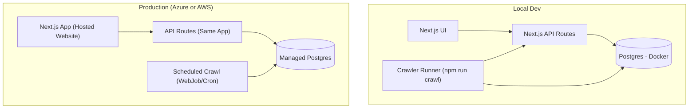

# InternAtlas
**A crawler-powered internship & new‑grad job aggregation site (searchable + filterable) with optional stats + AI matching.**

---

## Summary
InternAtlas ingests job listings from a curated set of company career sites / ATS providers (starting with **Greenhouse**), normalizes them into a **Postgres database**, and serves a **hosted job board** with fast **search + filters**.

This project is intentionally scoped for a **2‑week intensive build**:
- **Week 1:** working product (MVP: job board + search backed by DB)
- **Week 2:** polish + reliability + **stats** (stretch) + optional **AI match** (stretch)

---

## Resume outcome (4 bullets)
Use these (fill in your real numbers at the end):

- Built a job aggregation platform that **crawls and normalizes internship/new‑grad listings** across **N companies** and multiple ATS providers into a unified Postgres schema.
- Implemented **deduplication + upsert** logic using stable external IDs (when available) and deterministic hash keys, tracking job freshness (`first_seen`, `last_seen`) and status changes.
- Delivered a **searchable, filterable job board** using Postgres full‑text search + indexed filters (company, location, remote/onsite, date), served via an API and a hosted web UI.
- Added ingestion observability (crawl runs, error logs, coverage) and tests for parsers/API to improve reliability and prevent regressions.

---

## MVP goals (must ship)
### MVP #1 — Interactive job board (DB-backed)
- Job list is rendered from **your DB** (not mocked data).
- Filters:
  - Company
  - Location (text match)
  - Location type (Remote / Hybrid / Onsite / Unknown)
  - Employment type (Intern / New Grad / Full‑time / Unknown)
  - Date window (e.g., last 7/14/30 days)
- Sorting + pagination (newest first)

### MVP #2 — Search
- Keyword search across:
  - Title
  - Description
  - Requirements (best-effort)
- Search results remain filterable and paginated.

---

## Stretch goals (only after MVP is stable)
### Stretch A — Stats dashboard
Examples:
- Jobs by company
- Jobs by location type
- New jobs since last crawl run
- Jobs posted in last 7/14/30 days

### Stretch B — AI match (simple + defensible)
- User pastes resume text → returns “Top matching roles”
- Match score based on similarity between resume and job description/requirements.
- Privacy-first default: do **not** store raw resume text.

---

## Tech stack (condensed)
Primary (recommended for 2 weeks):
- **Node.js + TypeScript**
- **Next.js** (one app: UI + API in a single deployable service)
- **PostgreSQL** (local via Docker; cloud via Azure or AWS)
- **Prisma** (DB schema + queries)
- Postgres **Full‑Text Search** (tsvector + GIN index)

Why this is condensed:
- Next.js hosts the **frontend + API** together
- One codebase, one deploy target, fewer moving parts

### Is Python still an option?
Yes — you *can* write the crawler in Python.  
**But for a 2-week sprint, mixing languages increases overhead** (two dependency stacks, two runtimes, more glue). If you want maximum shipping speed + simplest deployment, keep everything **TypeScript**.

If you *really* want Python later:
- Add a separate `crawler_py/` that outputs normalized JSON
- Your TS backend ingests that JSON into Postgres  
(Out of scope for this 2-week plan unless you finish early.)

---

## Architecture
### Local development
- Next.js app (UI + API)
- A crawler runner (a TS script you trigger manually)
- Postgres in Docker

### Production deployment
- Hosted Next.js app on **Azure App Service** (or AWS equivalent)
- Postgres on **Azure Database for PostgreSQL** (or AWS RDS)
- Crawler triggered:
  - manually (admin button), and/or
  - scheduled (Azure WebJob / cron-like scheduler)



---

## Data captured (job record)
Each job should store enough data to power filters/search + reprocessing:

**Core fields (MVP)**
- `company_name`
- `title`
- `location`
- `location_type` (REMOTE | HYBRID | ONSITE | UNKNOWN)
- `employment_type` (INTERN | NEW_GRAD | FULL_TIME | UNKNOWN)
- `posted_at` (nullable)
- `job_url`
- `apply_url`
- `description_text` (cleaned)
- `requirements_text` (best-effort)
- `source_platform` (GREENHOUSE | LEVER | WORKDAY | CUSTOM)
- `raw_payload` (JSONB: raw job object / extraction for debugging)

**Freshness fields (high value, still simple)**
- `first_seen_at`
- `last_seen_at`
- `status` (ACTIVE | CLOSED | UNKNOWN)

---

## Core design choices (keeps it “Big Tech worthy” but not overbuilt)

### 1) Adapter-based ingestion (prevents scraping chaos)
Implement adapters per source type:

- `GreenhouseAdapter`
- `LeverAdapter`
- *(Stretch)* `WorkdayAdapter`

Each adapter does:
1) fetch jobs
2) map to a normalized schema

This keeps your code clean and extensible without microservices.

### 2) Deduplication strategy (simple, robust)
Prefer stable IDs when available:
- `(source_platform, external_job_id)` unique

Fallback:
- `dedupe_key = sha256(company + normalized_title + normalized_location + canonical_apply_url)`

Also track:
- `first_seen_at` (first time observed)
- `last_seen_at` (last time observed)
- `status` flips to CLOSED if not seen after X runs (stretch-lite)

### 3) Search that ships (Postgres FTS)
Use Postgres full-text search:
- `search_vector = to_tsvector(title + description + requirements)`
- GIN index on `search_vector`

This is fast, deployable, and interview-defensible.

---

## Source list strategy (what you will crawl)
**Don’t scrape giant job boards aggressively** (ToS + bot defenses).  
Instead, start with **company career pages** backed by predictable ATS systems.

MVP target:
- 15–30 companies total
- primarily Greenhouse + Lever (fast to add once adapter works)

---

## Repo layout (simple)
```
/internatlas
  /app                 # Next.js (UI + API)
    /data
      companies.json   # optional seed list
    /prisma
      schema.prisma
    /scripts
      crawl.ts         # "npm run crawl" entrypoint
      clear-jobs.ts    # "npm run jobs:clear"
```

---

## Configuration
### `data/companies.json` (optional seed)
You can seed a few companies here, but the primary workflow is the admin import UI.

```json
[
  {
    "name": "ExampleCo",
    "platform": "GREENHOUSE",
    "boardUrl": "https://boards.greenhouse.io/exampleco"
  },
  {
    "name": "AnotherCo",
    "platform": "LEVER",
    "boardUrl": "https://jobs.lever.co/anotherco"
  }
]
```

### Environment variables
- `DATABASE_URL=postgresql://...`
- *(Stretch/optional)* `OPENAI_API_KEY=...` for AI matching
- *(Optional)* `CRAWL_CONCURRENCY=5`
- *(Optional)* `CRAWL_TIMEOUT_MS=10000`

---

## API surface (MVP)
All API routes live in the Next.js app.

### `GET /api/jobs`
Query params:
- `q` (optional search query)
- `company` (optional, repeatable)
- `employmentType` (INTERN | NEW_GRAD | FULL_TIME)
- `locationType` (REMOTE | HYBRID | ONSITE)
- `location` (substring filter)
- `postedAfter` (ISO date)
- `sort` (`posted_at` | `last_seen_at`)
- `page`, `pageSize`

### `GET /api/companies`
Returns list of companies (for filter UI).

### *(Optional admin for demo)* `POST /api/admin/crawl`
Triggers a crawl run (guard with a simple secret header).

---

## UI requirements (MVP)
### Job Board page
- Search bar (debounced)
- Filter panel
- Results list + pagination
- Clicking a job opens a detail view (modal or page):
  - company, title, location
  - posted date
  - apply link
  - description + requirements
  - source platform (e.g., Lever/Greenhouse)

---

## Project phases (4 phases with checkboxes)
> The phases are designed so you always have something demoable and you never get stuck polishing without shipping.

### Phase 1 — Foundation (DB + app skeleton)
- [x] Create Next.js app + TypeScript setup
- [x] Spin up local Postgres (Docker) and connect via `DATABASE_URL`
- [x] Define Prisma schema: `companies`, `jobs`, *(optional)* `crawl_runs`
- [x] Build minimal UI: Job Board page with mock layout
- [x] Implement `GET /api/jobs` returning DB rows (even if empty)

**Exit criteria:** app runs locally, UI loads, API hits DB.

---

### Phase 2 — Ingestion MVP (jobs → DB)
- [x] Implement `scripts/crawl.ts` runner (manual trigger)
- [x] Build `GreenhouseAdapter` (first adapter)
- [x] Normalize job fields into your schema (title/location/urls/description/etc.)
- [x] Implement upsert + dedupe key strategy
- [x] Load 10+ companies that use the same platform and ingest real jobs

**Exit criteria:** running `npm run crawl` populates DB with real listings.

---

### Phase 3 — Product MVP (filters + search)
- [ ] Implement Postgres full‑text search (`search_vector` + GIN index)
- [ ] Add filters in API query (company/type/location/date)
- [ ] Hook UI filters + search to API
- [ ] Add pagination + sorting
- [ ] Make the job detail view clean + readable

**Exit criteria:** fully DB-backed job board with filters + search, demo-ready.

---

### Phase 4 — Ship polish + Stretch (stats + optional AI)
- [ ] Add crawl run logging (counts, duration, errors) *(simple table or logs)*
- [ ] Add Stats endpoint + small dashboard (jobs by company/location/type)
- [ ] Add basic test coverage (adapter unit tests + API tests)
- [ ] Deploy: hosted website + hosted backend + hosted Postgres
- [ ] *(Optional)* AI match endpoint + UI (paste resume → top matches)

**Exit criteria:** hosted project with measurable outcomes and a clean README + demo.

---

## Deployment plan (work locally first, then deploy)
### Local first (required)
- Use Docker Postgres locally
- Run:
  - Next dev server
  - crawl script manually

### Azure (recommended)
- **Azure Database for PostgreSQL** (managed DB)
- **Azure App Service** to host the Next.js app (UI + API)
- Schedule crawling with:
  - Azure WebJobs / cron-like scheduler, or
  - manual admin trigger for MVP demo

### AWS (also viable)
- **RDS Postgres**
- Host Next.js on:
  - Elastic Beanstalk (Node), or
  - ECS/Fargate (container)
- Schedule crawling with EventBridge + a small runner task

---

## Stretch: AI match (minimal plan)
Goal: “Paste resume text → return top jobs.”

Implementation (keep it simple):
- Build a combined job text blob: `title + description + requirements`
- Compute match score via:
  - embeddings similarity (resume ↔ job blob), or
  - lightweight keyword overlap (fallback)
- Return top K matches with a short “why matched” explanation (top keywords)

Privacy defaults:
- Do not store raw resume text
- Only store derived scores or embeddings if needed

---

## Success metrics (track these for your README + resume)
Capture and report at the end:
- Companies supported: **N**
- Total jobs ingested: **N**
- Median search latency: **~X ms**
- Crawl run duration: **X min**
- Crawl success rate: **X% companies succeeded/run**

These numbers are what turn “project” into “resume signal.”

---

## Notes on scope and legality
- Prefer crawling **company career pages** or ATS boards with stable public endpoints.
- Avoid aggressive scraping of large job boards with strict terms/anti-bot systems.
- Keep concurrency modest and add timeouts/retries to behave responsibly.

---

<!-- Context: this project plan is designed to strengthen your internship resume positioning. :contentReference[oaicite:0]{index=0} -->
### Admin import workflow (current)
Use `http://localhost:3000/admin` to build the company list:
- Paste Google results for Greenhouse boards
- Or paste raw HTML from a GitHub job board table (see Getting Started)
- Companies are stored in Postgres (view with Prisma Studio)

### Crawl commands (current)
- Crawl all jobs: `npm run crawl`
- Crawl with a keyword filter: `npm run crawl -- --keyword=intern`
- Clear all jobs (keeps companies): `npm run jobs:clear`
