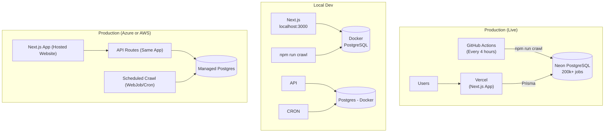

# InternAtlas
**A production job aggregation platform that crawls 1000+ companies across multiple ATS providers, serving 200,000+ internship and new-grad listings through a searchable, filterable job board.**

🌐 **Live Site:** [Deployed on Vercel](https://internatlas.vercel.app) (update with your actual URL)

---

## Summary
InternAtlas automatically ingests job listings from curated company career sites across multiple ATS providers (**Greenhouse**, **Workday**, **Lever**), normalizes them into a **PostgreSQL database** (Neon), and serves a **production-hosted job board** with real-time **search and advanced filtering**.

**Current Status:**
- ✅ **Live and deployed** on Vercel with Neon PostgreSQL
- ✅ **1000+ companies** tracked across 3 ATS platforms
- ✅ **200,000+ active job listings** with automatic status tracking
- ✅ **Automated crawling** every 4 hours via GitHub Actions
- ✅ **Production-ready** search, filters, and pagination

---

## Resume Bullets (Production Achievements)

- Built and deployed a **full-stack job aggregation platform** that crawls **1,000+ companies** across **3 ATS providers** (Greenhouse, Workday, Lever), normalizing **200,000+ internship/new-grad listings** into a unified PostgreSQL schema with automated status tracking.
- Implemented **deduplication and upsert logic** using stable external IDs and deterministic hash keys, tracking job lifecycle (`ACTIVE`/`CLOSED`) with automated status updates and freshness indicators (`first_seen`, `last_seen`).
- Delivered a **production job board** with Postgres full-text search, multi-dimensional filtering (company, location, status, date), and pagination, deployed on **Vercel with Neon PostgreSQL** serving live traffic.
- Architected **automated data pipeline** using **GitHub Actions** for scheduled crawling every 4 hours, with comprehensive error handling, logging, and observability for 900+ daily crawl operations.

---

## Features (✅ Shipped)
### Job Board
- ✅ **200,000+ live job listings** from PostgreSQL database
- ✅ **Multi-dimensional filters:**
  - Company name
  - Location (text search)
  - Job status (Open / Closed / Both)
  - Date posted (last seen timestamp)
- ✅ **7-column sortable table:** Company, Title, Description, Location, Date, Status, ATS
- ✅ **Pagination** with configurable page size
- ✅ **Status indicators** (active jobs vs. closed/expired)

### Search
- ✅ **Real-time keyword search** across:
  - Job title
  - Description
  - Company name
- ✅ **Filter + search combination** with instant results
- ✅ **Direct links** to company career pages and job postings

---

## Automation
- ✅ **GitHub Actions workflow** runs crawler every 4 hours
- ✅ **Automatic job status updates** (detects closed/expired listings)
- ✅ **Error handling and logging** for crawl operations
- ✅ **Zero-downtime deployment** with Vercel

## Planned Features (Phase 5)
### Custom Job Tables
- User-created filtered views (e.g., "MA Internships")
- Saved search preferences with keyword/location filters
- "NEW" badge indicators for jobs posted since last view

### Application Tracking
- "To Apply" and "Applied" job organization
- Personal application status tracking
- Firebase authentication for multi-user support

---

## Tech Stack
**Frontend:**
- **Next.js 14+** (App Router, TypeScript)
- **React** with Server Components
- **Tailwind CSS** for styling

**Backend:**
- **Next.js API Routes** (TypeScript)
- **Prisma ORM** 6.19.1 for database operations
- **PostgreSQL 16** for data persistence

**Infrastructure:**
- **Vercel** - Frontend and API hosting (free tier)
- **Neon** - Managed PostgreSQL (free 0.5GB tier)
- **GitHub Actions** - Automated crawling (free CI/CD)

**Crawling:**
- **TypeScript-based crawlers** for 3 ATS platforms:
  - Greenhouse (REST API)
  - Workday (HTML scraping)
  - Lever (REST API)
- Axios for HTTP requests
- Cheerio for HTML parsing (Workday)

**Why TypeScript-only?**
- Single language across stack = easier deployment
- Unified type system (Prisma schema → API → UI)
- No Python/Node interop complexity
- Faster development and debugging

---

## Architecture
### Local Development
- **Next.js app** (UI + API)
- **Docker Desktop** running PostgreSQL 16
- **Manual crawler execution** (`npm run crawl`)
- **Prisma Studio** for database inspection

### Production (Live)
- **Vercel** - Next.js app hosting (automatic deployments from `main` branch)
- **Neon PostgreSQL** - Managed database (0.5GB free tier, 200k+ jobs)
- **GitHub Actions** - Automated crawler runs every 4 hours
- **Environment Variables:**
  - `DATABASE_URL` - Neon connection string (stored in Vercel + GitHub Secrets)



---

## Data captured (job record)
Each job should store enough data to power filters/search + reprocessing:

**Core fields (MVP)**
- `company_name`
- `title`
- `location`
- `location_type` (REMOTE | HYBRID | ONSITE | UNKNOWN)
- `employment_type` (INTERN | NEW_GRAD | FULL_TIME | UNKNOWN)
- `posted_at` (nullable)
- `job_url`
- `apply_url`
- `description_text` (cleaned)
- `requirements_text` (best-effort)
- `source_platform` (GREENHOUSE | LEVER | WORKDAY | CUSTOM)
- `raw_payload` (JSONB: raw job object / extraction for debugging)

**Freshness fields (high value, still simple)**
- `first_seen_at`
- `last_seen_at`
- `status` (ACTIVE | CLOSED | UNKNOWN)

---

## Core design choices (keeps it “Big Tech worthy” but not overbuilt)

### 1) Adapter-based ingestion (prevents scraping chaos)
Implement adapters per source type:

- `GreenhouseAdapter`
- `LeverAdapter`
- *(Stretch)* `WorkdayAdapter`

Each adapter does:
1) fetch jobs
2) map to a normalized schema

This keeps your code clean and extensible without microservices.

### 2) Deduplication strategy (simple, robust)
Prefer stable IDs when available:
- `(source_platform, external_job_id)` unique

Fallback:
- `dedupe_key = sha256(company + normalized_title + normalized_location + canonical_apply_url)`

Also track:
- `first_seen_at` (first time observed)
- `last_seen_at` (last time observed)
- `status` flips to CLOSED if not seen after X runs (stretch-lite)

### 3) Search that ships (Postgres FTS)
Use Postgres full-text search:
- `search_vector = to_tsvector(title + description + requirements)`
- GIN index on `search_vector`

This is fast, deployable, and interview-defensible.

---

## Source list strategy (what you will crawl)
**Don’t scrape giant job boards aggressively** (ToS + bot defenses).  
Instead, start with **company career pages** backed by predictable ATS systems.

MVP target:
- 15–30 companies total
- primarily Greenhouse + Lever (fast to add once adapter works)

---

## Repo layout (simple)
```
/internatlas
  /app                 # Next.js (UI + API)
    /data
      companies.json   # optional seed list
    /prisma
      schema.prisma
    /scripts
      crawl.ts         # "npm run crawl" entrypoint
      clear-jobs.ts    # "npm run jobs:clear"
```

---

## Configuration
### `data/companies.json` (optional seed)
You can seed a few companies here, but the primary workflow is the admin import UI.

```json
[
  {
    "name": "ExampleCo",
    "platform": "GREENHOUSE",
    "boardUrl": "https://boards.greenhouse.io/exampleco"
  },
  {
    "name": "AnotherCo",
    "platform": "LEVER",
    "boardUrl": "https://jobs.lever.co/anotherco"
  }
]
```

### Environment variables
- `DATABASE_URL=postgresql://...`
- *(Stretch/optional)* `OPENAI_API_KEY=...` for AI matching
- *(Optional)* `CRAWL_CONCURRENCY=5`
- *(Optional)* `CRAWL_TIMEOUT_MS=10000`

---

## API surface (MVP)
All API routes live in the Next.js app.

### `GET /api/jobs`
Query params:
- `q` (optional search query)
- `company` (optional, repeatable)
- `employmentType` (INTERN | NEW_GRAD | FULL_TIME)
- `locationType` (REMOTE | HYBRID | ONSITE)
- `location` (substring filter)
- `postedAfter` (ISO date)
- `sort` (`posted_at` | `last_seen_at`)
- `page`, `pageSize`

### `GET /api/companies`
Returns list of companies (for filter UI).

### *(Optional admin for demo)* `POST /api/admin/crawl`
Triggers a crawl run (guard with a simple secret header).

---

## UI requirements (MVP)
### Job Board page
- Search bar (debounced)
- Filter panel
- Results list + pagination
- Clicking a job opens a detail view (modal or page):
  - company, title, location
  - posted date
  - apply link
  - description + requirements
  - source platform (e.g., Lever/Greenhouse)

---

## Project phases (4 phases with checkboxes)
> The phases are designed so you always have something demoable and you never get stuck polishing without shipping.

### Phase 1 — Foundation (DB + app skeleton)
- [x] Create Next.js app + TypeScript setup
- [x] Spin up local Postgres (Docker) and connect via `DATABASE_URL`
- [x] Define Prisma schema: `companies`, `jobs`, *(optional)* `crawl_runs`
- [x] Build minimal UI: Job Board page with mock layout
- [x] Implement `GET /api/jobs` returning DB rows (even if empty)

**Exit criteria:** app runs locally, UI loads, API hits DB.

---

### Phase 2 — Ingestion MVP (jobs → DB)
- [x] Implement `scripts/crawl.ts` runner (manual trigger)
- [x] Build `GreenhouseAdapter` (first adapter)
- [x] Normalize job fields into your schema (title/location/urls/description/etc.)
- [x] Implement upsert + dedupe key strategy
- [x] Load 10+ companies that use the same platform and ingest real jobs

**Exit criteria:** running `npm run crawl` populates DB with real listings.

---

### Phase 3 — Product MVP (filters + search)
- [ ] Implement Postgres full‑text search (`search_vector` + GIN index)
- [ ] Add filters in API query (company/type/location/date)
- [ ] Hook UI filters + search to API
- [ ] Add pagination + sorting
- [ ] Make the job detail view clean + readable

**Exit criteria:** fully DB-backed job board with filters + search, demo-ready.

---

### Phase 4 — Ship polish + Stretch (stats + optional AI)
- [ ] Add crawl run logging (counts, duration, errors) *(simple table or logs)*
- [ ] Add Stats endpoint + small dashboard (jobs by company/location/type)
- [ ] Add basic test coverage (adapter unit tests + API tests)
- [ ] Deploy: hosted website + hosted backend + hosted Postgres
- [ ] *(Optional)* AI match endpoint + UI (paste resume → top matches)

**Exit criteria:** hosted project with measurable outcomes and a clean README + demo.

---

## Deployment plan (work locally first, then deploy)
### Local first (required)
- Use Docker Postgres locally
- Run:
  - Next dev server
  - crawl script manually

### Azure (recommended)
- **Azure Database for PostgreSQL** (managed DB)
- **Azure App Service** to host the Next.js app (UI + API)
- Schedule crawling with:
  - Azure WebJobs / cron-like scheduler, or
  - manual admin trigger for MVP demo

### AWS (also viable)
- **RDS Postgres**
- Host Next.js on:
  - Elastic Beanstalk (Node), or
  - ECS/Fargate (container)
- Schedule crawling with EventBridge + a small runner task

---

## Stretch: AI match (minimal plan)
Goal: “Paste resume text → return top jobs.”

Implementation (keep it simple):
- Build a combined job text blob: `title + description + requirements`
- Compute match score via:
  - embeddings similarity (resume ↔ job blob), or
  - lightweight keyword overlap (fallback)
- Return top K matches with a short “why matched” explanation (top keywords)

Privacy defaults:
- Do not store raw resume text
- Only store derived scores or embeddings if needed

---

## Success metrics (track these for your README + resume)
Capture and report at the end:
- Companies supported: **N**
- Total jobs ingested: **N**
- Median search latency: **~X ms**
- Crawl run duration: **X min**
- Crawl success rate: **X% companies succeeded/run**

These numbers are what turn “project” into “resume signal.”

---

## Notes on scope and legality
- Prefer crawling **company career pages** or ATS boards with stable public endpoints.
- Avoid aggressive scraping of large job boards with strict terms/anti-bot systems.
- Keep concurrency modest and add timeouts/retries to behave responsibly.

---

<!-- Context: this project plan is designed to strengthen your internship resume positioning. :contentReference[oaicite:0]{index=0} -->
### Admin import workflow (current)
Use `http://localhost:3000/admin` to build the company list:
- Paste Google results for Greenhouse boards
- Or paste raw HTML from a GitHub job board table (see Getting Started)
- Companies are stored in Postgres (view with Prisma Studio)

### Crawl commands (current)
- Crawl all jobs: `npm run crawl`
- Crawl with a keyword filter: `npm run crawl -- --keyword=intern`
- Clear all jobs (keeps companies): `npm run jobs:clear`
